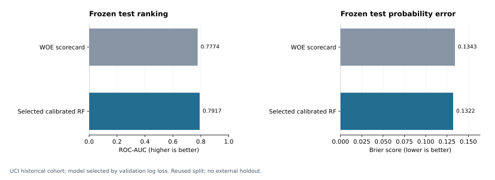
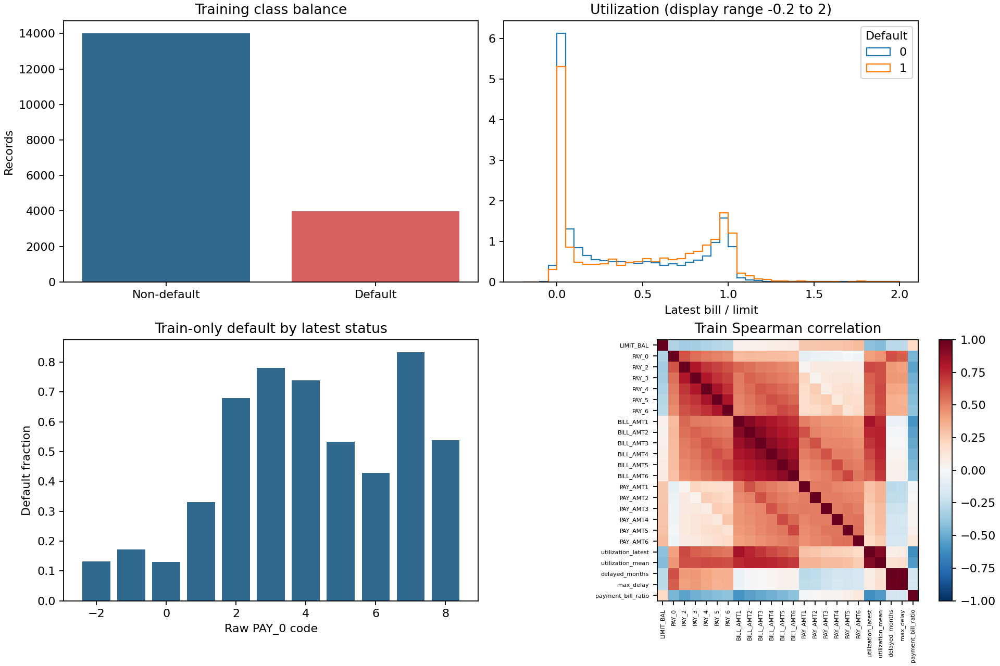
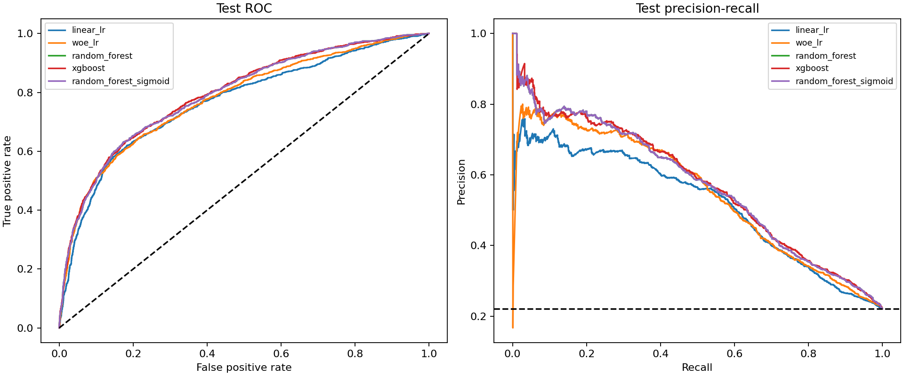
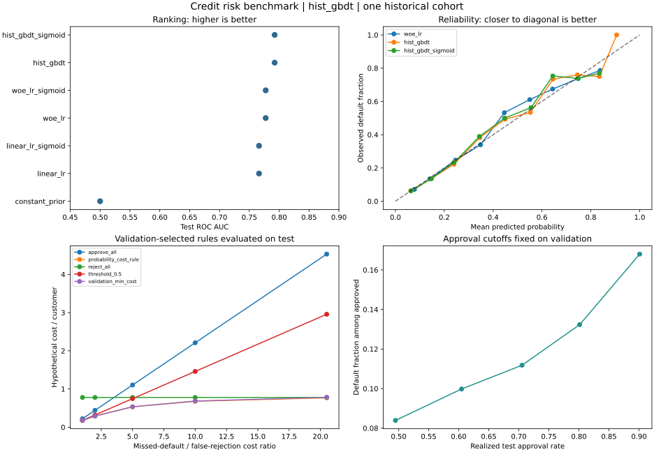
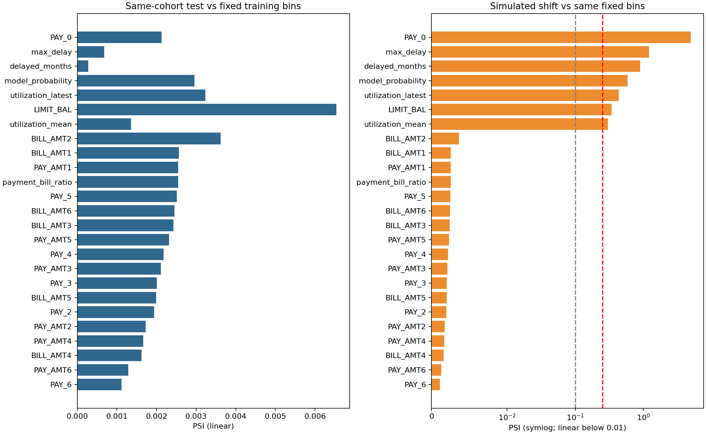

# Credit Risk Modeling

**Statistical Learning & Risk Decision** · Quantitative Decision Science · Selected Project 02

  

[Portfolio](https://github.com/xsm-math) · [01 Inventory](https://github.com/xsm-math/inventory-allocation) · [02 Credit Risk](https://github.com/xsm-math/Risk-Modeling) · [03 Gold Allocation](https://github.com/xsm-math/invest)

[](https://github.com/xsm-math/Risk-Modeling/actions/workflows/tests.yml)

| Project Summary | Historical credit-card default modeling from interpretable scores to calibrated probabilities and cost policies. |
|---|---|
| Research Question | How do scorecards and tree models compare in ranking, probability quality and asymmetric risk decisions? |
| Methods | WOE/IV logistic scorecard, six base estimators plus sigmoid variants, grouped splits/bootstrap, SQL parity, TreeSHAP and PSI diagnostics. |
| Key Results | Validation selects **random_forest_sigmoid**: frozen-test **AUC 0.7917**, **KS 0.4580**, **Brier 0.1322**. Under the fixed 1:5 cost scenario, cost is **0.5387** per customer versus WOE **0.5600**. |
| Evidence | [Test metrics](reports/credit/test_metrics.csv), [model policies](reports/credit/model_policies.csv), [selection](reports/credit/selection.json), [manifest](reports/credit/manifest.json). Costs are hypothetical normalized units; the published split is reused. |



[Research report](reports/credit/REPORT.md) · [Protocol](docs/credit_protocol.md) · [Data dictionary](docs/credit_data_dictionary.md)

## Abstract

This applied research project estimates next-month default risk for existing
credit-card customers using 30,000 public historical records. It compares an
additive WOE logistic scorecard with raw logistic regression, Random Forest,
XGBoost and histogram gradient boosting. Independent probability calibration,
cost-based thresholds, grouped uncertainty estimates and drift diagnostics
connect predictive performance to a transparent decision exercise.
All reported numbers are generated by executed experiments.

## Problem Definition

A useful risk model must rank customers, estimate credible default probabilities
and support decisions with explicit costs. A high AUC alone does not settle an
approval policy. We study normalized costs for rejecting a non-defaulting customer
and approving a defaulting customer; these scenarios are not actual bank profits.
The task concerns existing cardholders, not an identified causal effect of
accepting or rejecting new applicants.

## Statistical Formulation

For each numeric variable, the inherited encoder fits zero-aware quantile bins
and merges sparse adjacent bins on train. The convention is
`WOE = log(bad share / good share)`; IV sums `(bad share − good share) × WOE`.
EPS smoothing and the encoder's two-bin stopping rule are documented.
Missing values use train medians; the verified source has no missing cells.
No monotonicity constraint or IV-based test selection is claimed.

```text
logit(PD) = b + sum(beta_j * WOE_j)
factor = PDO / ln(2)
offset = base_score - factor * ln(base_odds_good_to_bad)
score = offset - factor * logit(PD)
```

600 points correspond to good:bad odds 20:1, with PDO=20: doubling good:bad odds
adds 20 points. Standardized LR coefficients are restored to WOE units before
conversion. [Bin points](reports/credit/scorecard_bins.csv),
[IV and coefficients](reports/credit/iv_coefficients.csv) and the
[portable score specification](reports/credit/scorecard.json) are exported.
The summed unrounded points must reconstruct the raw WOE model probability
within 1e-12. A separately calibrated WOE model is not silently substituted for this card.

## Data

[Yeh (2009), UCI Default of Credit Card Clients](https://doi.org/10.24432/C55S3H),
CC BY 4.0: six months of payment status, bills and payments from April–September
2005 and a next-month default label. Observed default rate: **22.12%**.
The official archive is downloaded with a pinned SHA256 and strict schema checks.
No synthetic fallback is used for this benchmark.

The quality audit reports missing cells, invalid/nonfinite values, duplicate
financial histories, conflicting labels, extreme quantiles and undocumented codes.
Negative bills and high utilization are preserved as potentially valid behavior.
ID and all four demographic fields are excluded from prediction. Identical
financial records stay in the same partition, including conflicting-label groups.
Full-population quality counts are descriptive; labeled feature analysis uses train only.



## Methodology

### ML Benchmarks

Six base estimators each receive a holdout sigmoid variant:

| Base estimator | Purpose and imbalance strategy |
|---|---|
| Linear LR | Standardized raw-feature probability baseline |
| WOE LR | Additive scorecard baseline; all 24 features retained |
| Balanced linear LR | `class_weight=balanced` ablation |
| Random Forest | 250 trees, depth 10, leaf minimum 30, balanced bootstrap weights |
| XGBoost | 250 shallow trees, `scale_pos_weight=1`, regularized probability learner |
| Histogram GBDT | Existing fixed-capacity benchmark retained for continuity |

No oversampling is used. Class weighting can distort raw probability levels;
independent calibration and cost thresholds are evaluated alongside it.
The same rows, 24 account inputs and probability objective apply across learners.
Actual parameter dictionaries, package versions and checksums accompany the results.

### Calibration

Sigmoid fits on clipped base logits using the calibration holdout without
refitting the base learner. Raw and calibrated variants are retained, including
negative results. Validation, not test performance, chooses the final variant.
Reliability plots include per-bin sample counts; Brier alone cannot distinguish
calibration from discrimination. See [probability metrics](reports/credit/test_metrics.csv)
and [reliability bins](reports/credit/reliability.csv).

### SQL Feature Engineering

[Executable SQLite SQL](sql/behavior_features.sql) unpivots actual six-period
histories, then uses CTEs, CASE and ROW_NUMBER for utilization, delinquency counts,
max delay, payment/bill ratios and recent-three-period aggregates.
Five shared features are compared with Python on all 30,000 records with 1e-12
tolerance. The extra three-period outputs illustrate SQL and do not alter the model
silently. Account age is unavailable because opening dates are absent.

## Experimental Design

Ten stratified group folds form approximately 60% train, 10% calibration, 10%
validation and 20% test. Train fits preprocessing and estimators; calibration fits
sigmoid mappings; validation chooses model/calibration by minimum log loss and
sets policies; test evaluates the frozen choices. Capacities and cost scenarios
are fixed in [configs/credit.json](configs/credit.json), without a large search.

**Revision provenance:** this extension reuses the previously published 2026-10-02
split for continuity. It does not claim a new untouched or external holdout.
Validation serves both model and threshold selection. Bootstrap intervals describe
conditional test sampling uncertainty, not the uncertainty of retraining or future cohorts.

### Metrics and uncertainty

ROC-AUC and KS measure ranking; average precision and trapezoidal PR-AUC are
reported separately. Precision, recall, F1 and confusion counts are tied to explicit
policies. Brier and log loss evaluate probability quality, alongside a constant
training-prior baseline. Five hundred paired group bootstrap samples quantify the
selected model's AUC, its difference versus WOE and its hypothetical cost difference.



## Results

Validation selects **random_forest_sigmoid**; the following rows summarize frozen test results.
All twelve candidate variants and the constant-prior baseline remain in the CSV.

| model | auc | ks | average_precision | brier | log_loss |
| --- | --- | --- | --- | --- | --- |
| linear_lr | 0.7662 | 0.4366 | 0.5185 | 0.1383 | 0.4402 |
| woe_lr | 0.7774 | 0.4308 | 0.5478 | 0.1343 | 0.4298 |
| hist_gbdt | 0.7924 | 0.4519 | 0.5631 | 0.1322 | 0.4219 |
| random_forest | 0.7917 | 0.4580 | 0.5700 | 0.1724 | 0.5251 |
| random_forest_sigmoid | 0.7917 | 0.4580 | 0.5700 | 0.1322 | 0.4216 |
| xgboost | 0.7936 | 0.4553 | 0.5728 | 0.1315 | 0.4201 |

The selected policy has precision **38.45%**, default recall **75.41%**,
F1 **0.5093** and approval rate **56.64%**. Its normalized cost is
**0.5387 per customer**, versus **0.5600** for the raw WOE baseline,
each using its own validation-selected cutoff. This trade-off is a retrospective
scenario, not realized savings or an estimated effect of rejecting customers.



Explanations include WOE coefficients and additive bin points, validation
permutation importance, RF impurity/XGBoost gain importance, and native exact
TreeSHAP for 512 XGBoost validation records. TreeSHAP additivity is verified in raw
log-odds space; explanations are descriptive, not causal.

| Consideration | WOE scorecard | Boosting |
|---|---|---|
| Representation | Additive bins and points | Nonlinear splits and interactions |
| Explanation | Direct bin contributions; coefficients conditional on other inputs | Permutation/SHAP subject to feature dependence |
| Deployment | Small rules and logistic arithmetic | Versioned model runtime |
| Governance | Audit binning and point mappings | Audit capacity, explanations and serving compatibility |
| Limit | Coarse bins, correlated inputs, unconstrained monotonicity | More operational complexity; gain importance can mislead |

## Robustness and Sensitivity Analysis

Feature and score PSI use training-fixed bins, missing/unknown states and
half-count smoothing. Compare the same-cohort test population with a clearly
labeled simulation: reduce credit limits by 30% and increase nonnegative latest
payment status by one; then recompute dependent features. This tests sensitivity
and monitoring logic, not observed future default accuracy.
PSI 0.1/0.25 thresholds are review heuristics. Small PSI does not establish stable
conditional risk or calibration. Genuine OOT cannot be constructed from this single cohort.



[Cost sensitivity](reports/credit/cost_sensitivity.csv) varies false-rejection/missed-default ratios 1, 2, 5, 10 and 20.5; grouped bootstrap intervals retain duplicate-input groups. Calibration ablations preserve adverse results. These quantify conditional retrospective variation, not performance on a new cohort.

## Business Interpretation

The primary scenario costs a false rejection 1 unit and a missed default 5 units.
Empirical cost is `FP + 5 × FN`; validation selects a threshold over whole tied-score
blocks, including all-approve/all-reject. If probabilities and costs are accurate,
the expected-cost rule is `PD >= 1/(1+5)`. The selected empirical threshold is
**0.171438**. The report compares both rules, 0.5, all-approve and all-reject,
plus cost ratios 1, 2, 5, 10 and 20.5 and validation-defined approval targets.
Actual EAD and LGD are unavailable; normalized loss is not a currency estimate.

The model supports a transparent probability-to-cost exercise; changing the loss ratio changes the policy. Better ranking does not itself determine rejection capacity or actual lending profitability. The WOE scorecard remains an auditable additive benchmark, while calibrated tree models add probability and runtime complexity.

## Limitations

Historical Taiwan existing-cardholder data and a reused published split provide
limited external evidence. No real rejected applicant records, actual recovery
costs, mature multi-cohort labels, deployment or prospective financial outcomes
are available. Status -2/0 meanings are incompletely documented; LR treats status
numerically. Binning is not monotonic, IV is univariate, correlated inputs complicate
explanation, and excluding demographic fields does not establish fairness or legal compliance.
Reject inference is discussed as a selection-bias problem, without fabricated labels.

## Future Work

Obtain recent snapshot-dated cohorts and point-in-time feature availability; assess
rolling OOT ranking, calibration and cost policies. Compare monotonic scorecards,
feature-group ablations, segment fairness, missingness stress, capacity constraints
and loss estimates from observed EAD/LGD. Add label-maturity-aware monitoring and
shadow evaluation before any prospective decision use.

## Repository Structure

| Directory | Role |
|---|---|
| `src/credit/` | Verified loading, features, model/calibration, decisions, diagnostics, SQL checks, reporting |
| `src/risk/`, `src/train.py` | Original NumPy synthetic scoring study |
| `configs/` | Frozen experiment configuration |
| `data/raw/`, `data/processed/` | Local raw data and row-level audit records |
| `scripts/`, `sql/` | One-command workflow and executable behavior aggregation |
| `tests/` | Numerical, split, calibration, scorecard, PSI, SQL and serialization checks |
| `reports/credit/` | Published aggregate figures, tables and provenance |
| `docs/` | Experiment protocol, monitoring and scorecard methodology |

Original study: [synthetic baseline](SYNTHETIC_BASELINE.md) and
[historical limitations](docs/methodology.md), run via `python -m src.train`.
Its results must not be combined with the real-data benchmark.

References: [UCI metadata](https://www.archive.ics.uci.edu/dataset/350/default%2Bof%2Bcredit%2Bcard%2Bclients),
[scikit-learn calibration](https://scikit-learn.org/stable/modules/calibration.html),
[XGBoost Python API](https://xgboost.readthedocs.io/en/stable/python/python_api.html).

## Reproducibility

Python 3.11/3.12; the published runtime is pinned in
[requirements-credit-repro.txt](requirements-credit-repro.txt).

```bash
git clone https://github.com/xsm-math/Risk-Modeling.git
cd Risk-Modeling
python -m venv .venv
# PowerShell: .venv\Scripts\Activate.ps1
# Linux/macOS: source .venv/bin/activate
python -m pip install -r requirements-credit-repro.txt
python scripts/run_all.py
python -m pytest -q
```

The one-command workflow verifies/downloads data, trains, evaluates, checks SQL and
scorecard parity, and regenerates the research report and README.
To retain committed tables while reproducing elsewhere:

```bash
python -m src.credit download
python -m src.credit run --output reports/generated
```

Batch inference after training:

```bash
python -m src.credit score --input customers.csv --output predictions.csv
python -m src.credit score --input customers.csv --output scorecard_predictions.csv --model artifacts/credit_scorecard.joblib
```

The input needs the 19 raw account fields; labels are unnecessary. The scorecard
artifact also emits points. Load only trusted model artifacts. Source archives,
split IDs, individual predictions and fitted models stay local and are ignored by Git.


Presentation-only summary: `python scripts/portfolio_summary.py --project credit`. Input hashes are recorded in [the chart manifest](assets/portfolio/manifest.json). Regenerating the README uses [the same research template](docs/README.template.md).
