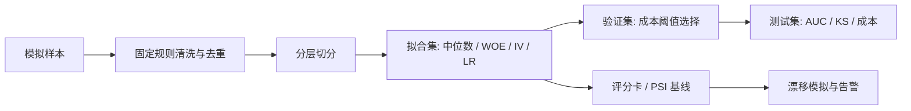

# Risk Modeling｜信用违约预测与成本敏感策略

[](https://github.com/xsm-math/Risk-Modeling/actions/workflows/tests.yml)

使用 **NumPy + pandas** 实现从数据清洗、WOE/IV、逻辑回归到评分卡、成本阈值选择和 PSI 监控的完整实验流程。

**项目定位：模拟数据上的个人风控建模项目。** 8,000 条样本由固定随机种子生成；指标和成本改善均为离线实验结果，不代表真实银行数据、生产上线或实际收益。

## 项目结果

| 指标 | seed=42 的复现结果 |
| --- | --- |
| 数据量 / 坏样本率 | 8,000 / 2.41% |
| 拟合 / 验证 / 测试 | 4,481 / 1,120 / 2,399 |
| 入模特征 | 8 / 12 |
| 测试 AUC / KS | **0.7339 / 0.3645** |
| 验证集选择的阈值 | 0.036283 |
| 测试成本：0.5 阈值 → 所选阈值 | 467,400 → 384,200 元 |
| 假设成本降低 | **17.80%** |
| 所选策略通过率 / 坏样本召回率 | 88.95% / 38.60% |
| 最大 PSI（含分数） | 0.0131 |
| 收入 ×1.3 漂移模拟 | 触发告警 |

成本假设：误拒好客户 400 元/人，放行坏客户 8,200 元/人。结果由 [summary.json](outputs/summary.json) 和 [实验报告](outputs/report.md) 提供依据。
历史版本曾使用同一数据的测试指标挑选分箱配置；本次已修复流程，但上述结果仍应作为教学基线。详见 [方法与边界](docs/methodology.md)。

## 核心实现

- **控制数据泄漏：**中位数、分箱、WOE/IV、标准化和模型均只在拟合集学习；验证集选择阈值。
- **保留稀疏特征信息：**零值分段、低样本箱合并，并保存原始区间到 WOE 的映射。
- **可解释评分：**实现带 L2 的逻辑回归梯度下降，还原标准化系数后转换为评分卡。
- **成本敏感决策：**报告全通过、全拒绝、0.5 阈值与验证集所选阈值的测试成本。
- **分布监控：**输出特征和分数 PSI，完成收入漂移模拟及三级告警。
- **可验证实现：**AUC 两种算法交叉核对，使用 sklearn 校验数值实现，测试数据隔离、评分卡重构、分箱映射和监控边界。



## 快速运行

Python 3.11 或 3.12；无需下载外部数据。

```bash
git clone https://github.com/xsm-math/Risk-Modeling.git
cd Risk-Modeling
python -m venv .venv
# Windows PowerShell: .venv\Scripts\Activate.ps1
# macOS / Linux: source .venv/bin/activate
python -m pip install -r requirements.txt
python -m src.train
```

测试（含 sklearn 对照）：

```bash
python -m pip install -r requirements-dev.txt
python -m pytest -q
```

首次运行自动生成 `data/raw/credit.csv`。使用默认配置复现时，应保持该文件为程序生成的版本；若手动替换，输出会随数据改变。
发布验证：**22 项测试通过**，详情见 [验证记录](docs/validation.md)。

## 目录

```text
src/train.py              端到端训练与报告入口
src/risk/data.py          模拟数据与读取
src/risk/config.py        实验参数、成本假设
src/risk/features.py      WOE/IV、分箱与评分卡
src/risk/model.py         NumPy 逻辑回归
src/risk/metrics.py       AUC、KS、成本与 PSI
src/risk/monitor.py       特征和分数监控
tests/                    数值校验与回归测试
outputs/                  已复现的汇总指标、表格与报告
docs/                     方法与验证记录
.github/workflows/        自动化测试
```

逐客预测文件只在本地运行后生成；仓库保留汇总报告。训练输出会覆盖 `outputs/` 下同名实验结果。

## 后续工作

后续重点是接入真实公开数据、独立留出验证和概率校准；当前未实现 OOT、拒绝推断、树模型业务对比或部署。
